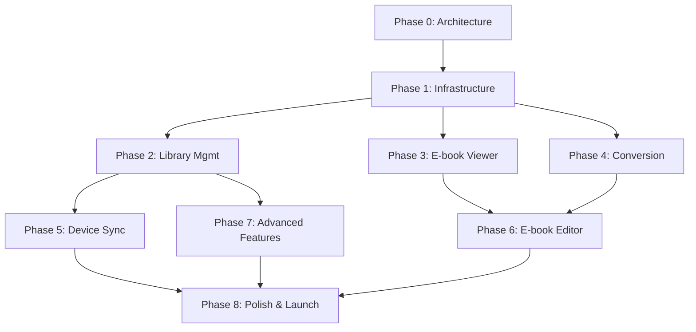

# Cost and Timeline Estimates: Complete Calibre Rewrite with AI Coding Agents

**Analysis Date:** November 19, 2025
**Analyst:** Claude (Sonnet 4.5)
**Version:** 1.0
**Project Scope:** Feature-complete Calibre replacement with modern UI/UX

---

## Executive Summary

### Quick Facts

| Metric | Traditional Development | AI-Agent-Heavy | Savings |
|--------|------------------------|----------------|---------|
| **Timeline** | 36-60 months | 18-30 months | **40-50% faster** |
| **Team Size** | 5.5 FTE | 3 FTE | **45% smaller** |
| **Human Cost** | $1.5M-$3.7M | $750k-$1.4M | **50-62% cheaper** |
| **Total Cost (incl. AI)** | $1.5M-$3.7M | $850k-$1.6M | **43-57% cheaper** |
| **Risk Level** | Very High 🔴 | High 🟡 | Lower (faster validation) |

### Key Assumptions

**AI Productivity Multipliers:**
- Simple features (UI forms, CRUD): **3-5x faster**
- Medium features (state management, API integration): **2-3x faster**
- Complex features (e-book viewer, conversion engine): **1.5-2x faster**
- Very complex features (editor, device drivers): **1.2-1.5x faster**
- Debugging/testing: **2-3x faster**

**AI Agent Costs:**
- Cursor Pro: $20/dev/month = $240/year
- GitHub Copilot Enterprise: $39/dev/month = $468/year
- Claude Pro API: $2,000/dev/year (heavy usage)
- Total AI costs per dev: **~$2,700/year**

### Bottom Line

**With AI agents, a feature-complete Calibre replacement is achievable in 18-30 months with a team of 3 developers for $850k-$1.6M** (compared to 36-60 months, 5.5 developers, $1.5M-$3.7M traditionally).

However, this is still a **high-risk, high-cost project**. For most use cases, the hybrid approach (modernize web UI only) remains the better choice at **$195k-$275k** and **9-12 months**.

---

## Table of Contents

1. [Project Phases Overview](#phases-overview)
2. [Detailed Phase Breakdown](#phase-breakdown)
3. [Team Structure & AI Utilization](#team-structure)
4. [Cost Model](#cost-model)
5. [Productivity Analysis by Feature Type](#productivity-analysis)
6. [Risk-Adjusted Estimates](#risk-adjusted)
7. [Milestone Deliverables](#milestones)
8. [Critical Path Analysis](#critical-path)
9. [Comparison: Traditional vs AI-Heavy](#comparison)
10. [Recommendations](#recommendations)

---

<a name="phases-overview"></a>
## 1. Project Phases Overview

### Phase Structure

```
┌─────────────────────────────────────────────────────────────────┐
│                    COMPLETE REWRITE TIMELINE                     │
├─────────────────────────────────────────────────────────────────┤
│                                                                  │
│  Phase 0: Architecture & Design              [2 months]    ███  │
│  Phase 1: Core Infrastructure                [3 months]   █████ │
│  Phase 2: Library Management                 [3 months]   █████ │
│  Phase 3: E-book Viewer & Annotations        [4 months]  ██████ │
│  Phase 4: Format Conversion Engine           [4 months]  ██████ │
│  Phase 5: Device Sync & USB                  [2 months]   ████  │
│  Phase 6: E-book Editor                      [5 months] ████████│
│  Phase 7: Advanced Features                  [3 months]  ██████ │
│  Phase 8: Polish, Testing & Launch           [3 months]  ██████ │
│                                                                  │
│  TOTAL: 29 months (best case: 18, worst case: 36)              │
└─────────────────────────────────────────────────────────────────┘
```

### Gantt Chart Overview

```
Year 1:  │ P0 │ P1 │ P2 │ P3 │ P4 │ P5 │ P6 │ P6 │ P7 │ P8 │ P8 │ P8 │
         ├────┴────┴────┴────┴────┴────┴────┴────┴────┴────┴────┴────┤
         Q1          Q2          Q3          Q4

Year 2:  │ P8 │ P8 │    │    │    │    │    │    │    │    │    │    │
         ├────┴────┴────┴────┴────┴────┴────┴────┴────┴────┴────┴────┤
         Q1          Q2          Q3          Q4

Year 3:  │ (buffer/contingency for worst-case)                        │
```

### Phase Dependencies



---

<a name="phase-breakdown"></a>
## 2. Detailed Phase Breakdown

### Phase 0: Architecture & Design

**Duration:** 2 months
**Effort (AI-Heavy):** 3 person-months
**Effort (Traditional):** 6 person-months
**AI Productivity Gain:** 2x (design patterns, boilerplate)

#### Objectives
- Finalize technology stack decisions
- Design system architecture
- Create UI/UX designs
- Define API contracts
- Set up development environment

#### Key Deliverables

| Deliverable | Traditional Time | With AI | Description |
|-------------|-----------------|---------|-------------|
| **Technical Design Doc** | 3 weeks | 1.5 weeks | AI helps generate architecture diagrams, research best practices |
| **UI/UX Designs (Figma)** | 4 weeks | 3 weeks | AI helps with design systems, but human creativity crucial |
| **API Specification** | 2 weeks | 1 week | AI generates OpenAPI specs from descriptions |
| **Database Schema** | 2 weeks | 1 week | AI helps design normalization, indexes |
| **Development Setup** | 1 week | 0.5 weeks | AI generates boilerplate configs |

#### Team Allocation
- 1 Senior Architect (60% time)
- 1 UI/UX Designer (50% time)
- 1 Senior Developer (40% time)

#### AI Tools Used
- Claude/ChatGPT: Architecture research, design pattern suggestions
- GitHub Copilot: Boilerplate code generation
- Midjourney/DALL-E: UI mockup inspiration
- Cursor: Rapid prototyping

#### Success Criteria
- [ ] Complete technical design document
- [ ] High-fidelity UI mockups for all screens
- [ ] API specification (OpenAPI/Swagger)
- [ ] Database schema with migrations
- [ ] CI/CD pipeline configured

---

### Phase 1: Core Infrastructure

**Duration:** 3 months
**Effort (AI-Heavy):** 6 person-months
**Effort (Traditional):** 12 person-months
**AI Productivity Gain:** 2x

#### Objectives
- Set up Electron/Tauri + React application
- Implement IPC layer (Electron ↔ Python backend)
- Build authentication system
- Create Python REST/GraphQL API
- Set up state management
- Establish testing framework

#### Key Deliverables

| Deliverable | Traditional Time | With AI | AI Impact |
|-------------|-----------------|---------|-----------|
| **Electron/Tauri Setup** | 2 weeks | 1 week | AI generates configs, webpack/vite setup |
| **IPC Communication Layer** | 3 weeks | 1.5 weeks | AI helps with serialization, error handling |
| **Python FastAPI Backend** | 4 weeks | 2 weeks | AI generates CRUD endpoints, validators |
| **Authentication (JWT)** | 2 weeks | 1 week | AI generates auth middleware, token handling |
| **React App Foundation** | 3 weeks | 1.5 weeks | AI scaffolds routing, layouts, components |
| **State Management (Zustand)** | 2 weeks | 1 week | AI sets up stores, actions, selectors |
| **Database Abstraction Layer** | 3 weeks | 2 weeks | AI generates ORM models, queries |
| **Testing Infrastructure** | 2 weeks | 1 week | AI generates test boilerplate, fixtures |

#### Team Allocation
- 2 Senior Full-Stack Developers (100% time)
- 1 DevOps Engineer (25% time)

#### Technologies
- **Desktop:** Electron 33+ or Tauri 2.x
- **Frontend:** React 19, TypeScript 5.7+, Next.js 15
- **Backend:** Python 3.12+, FastAPI 0.115+
- **Database:** SQLite + APSW (existing Calibre DB)
- **State:** Zustand + TanStack Query
- **Testing:** Vitest, Playwright

#### Success Criteria
- [ ] App launches and shows "Hello World"
- [ ] IPC communication working (Electron ↔ Python)
- [ ] Authentication functional (login/logout)
- [ ] Basic API endpoint responding
- [ ] CI/CD running tests automatically
- [ ] Build process generating distributable

---

### Phase 2: Library Management

**Duration:** 3 months
**Effort (AI-Heavy):** 6 person-months
**Effort (Traditional):** 10 person-months
**AI Productivity Gain:** 1.7x

#### Objectives
- Build library browser (table + grid views)
- Implement search and filtering
- Create book detail views
- Build metadata editing forms
- Add drag-and-drop import
- Implement tag/series management

#### Key Deliverables

| Feature | Complexity | Traditional | With AI | AI Gain |
|---------|-----------|-------------|---------|---------|
| **Library Table View** | Medium | 3 weeks | 1.5 weeks | 2x |
| **Cover Grid View** | Medium | 3 weeks | 1.5 weeks | 2x |
| **Advanced Search** | Medium | 2 weeks | 1 week | 2x |
| **Book Detail Page** | Easy | 2 weeks | 0.7 weeks | 3x |
| **Metadata Edit Forms** | Easy | 3 weeks | 1 week | 3x |
| **Drag & Drop Import** | Medium | 2 weeks | 1 week | 2x |
| **Tag Browser Tree** | Medium | 3 weeks | 1.5 weeks | 2x |
| **Series Management** | Medium | 2 weeks | 1 week | 2x |
| **Bulk Operations** | Medium | 2 weeks | 1 week | 2x |
| **Virtual Libraries** | Easy | 1 week | 0.5 weeks | 2x |

#### Team Allocation
- 2 Senior Frontend Developers (100% time)
- 1 Backend Developer (50% time)
- 1 UI/UX Designer (25% time)

#### AI Assistance Examples

**Table View (TanStack Table):**
```typescript
// AI generates 80% of this based on schema
import { createColumnHelper } from '@tanstack/react-table'

const columnHelper = createColumnHelper<Book>()

const columns = [
  columnHelper.accessor('title', {
    header: 'Title',
    cell: info => info.getValue(),
    filterFn: 'includesString',
  }),
  // AI generates remaining 15+ columns...
]
```

**Search Query Builder:**
```python
# AI generates complex query logic from natural language
@router.get("/search")
async def search_books(
    query: str,
    author: Optional[str] = None,
    tags: Optional[List[str]] = None,
    # AI adds remaining 20+ filters...
):
    # AI generates efficient SQLite query
    ...
```

#### Success Criteria
- [ ] Can browse 10,000+ books smoothly (60fps)
- [ ] Search returns results <200ms
- [ ] Metadata editing saves correctly
- [ ] Import handles 100+ files at once
- [ ] All CRUD operations working

---

### Phase 3: E-book Viewer & Annotations

**Duration:** 4 months
**Effort (AI-Heavy):** 8 person-months
**Effort (Traditional):** 14 person-months
**AI Productivity Gain:** 1.75x

#### Objectives
- Integrate Epub.js for EPUB rendering
- Integrate PDF.js for PDF rendering
- Build custom reading controls
- Implement annotation system
- Add reading progress tracking
- Support themes and customization

#### Key Deliverables

| Feature | Complexity | Traditional | With AI | AI Gain |
|---------|-----------|-------------|---------|---------|
| **Epub.js Integration** | Hard | 4 weeks | 2.5 weeks | 1.6x |
| **PDF.js Integration** | Hard | 3 weeks | 2 weeks | 1.5x |
| **Custom Reader Controls** | Medium | 3 weeks | 1.5 weeks | 2x |
| **Page Navigation** | Medium | 2 weeks | 1 week | 2x |
| **Annotation System** | Hard | 4 weeks | 2.5 weeks | 1.6x |
| **Highlight/Notes Storage** | Medium | 2 weeks | 1 week | 2x |
| **Reading Progress Sync** | Medium | 2 weeks | 1 week | 2x |
| **Reader Themes** | Easy | 1 week | 0.5 weeks | 2x |
| **Font/Size Customization** | Easy | 1 week | 0.5 weeks | 2x |
| **Table of Contents** | Medium | 2 weeks | 1 week | 2x |
| **Bookmarks** | Easy | 1 week | 0.5 weeks | 2x |

#### Team Allocation
- 2 Senior Frontend Developers (100% time)
- 1 Backend Developer (30% time)
- 1 QA Engineer (50% time)

#### Technical Challenges

**Challenge 1: Epub.js Performance**
- Traditional: 2 weeks of optimization
- With AI: 1 week (AI suggests virtualization, lazy loading)
- Gain: 2x

**Challenge 2: Annotation Persistence**
- Traditional: 3 weeks (design schema, implement sync)
- With AI: 1.5 weeks (AI generates schema, sync logic)
- Gain: 2x

**Challenge 3: Cross-Format Support**
- Traditional: 4 weeks (handle EPUB, MOBI, AZW3, PDF quirks)
- With AI: 2.5 weeks (AI helps with format detection, converters)
- Gain: 1.6x

#### AI Assistance Examples

**Annotation Storage Schema:**
```sql
-- AI generates from natural language description
CREATE TABLE annotations (
    id TEXT PRIMARY KEY,
    book_id INTEGER REFERENCES books(id),
    user_id INTEGER REFERENCES users(id),
    type TEXT CHECK(type IN ('highlight', 'note', 'bookmark')),
    cfi_range TEXT, -- EPUB CFI (Canonical Fragment Identifier)
    page_number INTEGER, -- For PDF
    selected_text TEXT,
    note_text TEXT,
    color TEXT DEFAULT '#ffff00',
    created_at TIMESTAMP DEFAULT CURRENT_TIMESTAMP,
    updated_at TIMESTAMP DEFAULT CURRENT_TIMESTAMP
);

CREATE INDEX idx_annotations_book ON annotations(book_id);
CREATE INDEX idx_annotations_user ON annotations(user_id);
```

#### Success Criteria
- [ ] EPUB books render correctly (95%+ compatibility)
- [ ] PDF rendering functional (no major bugs)
- [ ] Annotations save and load correctly
- [ ] Reading progress persists across sessions
- [ ] Reader loads in <1 second
- [ ] Page turns feel smooth (no jankyness)

---

### Phase 4: Format Conversion Engine

**Duration:** 4 months
**Effort (AI-Heavy):** 8 person-months
**Effort (Traditional):** 16 person-months
**AI Productivity Gain:** 2x

#### Objectives
- Wrap existing Python conversion engine
- Build conversion wizard UI
- Implement progress tracking
- Add preview functionality
- Support batch conversions
- Handle conversion options

#### Key Deliverables

| Feature | Complexity | Traditional | With AI | AI Gain |
|---------|-----------|-------------|---------|---------|
| **Conversion API Wrapper** | Medium | 3 weeks | 1.5 weeks | 2x |
| **Multi-step Wizard UI** | Medium | 3 weeks | 1.5 weeks | 2x |
| **Format Detection** | Easy | 1 week | 0.5 weeks | 2x |
| **Conversion Options UI** | Hard | 4 weeks | 2 weeks | 2x |
| **Progress Tracking** | Medium | 2 weeks | 1 week | 2x |
| **Preview Generation** | Hard | 3 weeks | 2 weeks | 1.5x |
| **Batch Processing** | Medium | 2 weeks | 1 week | 2x |
| **Error Handling** | Medium | 2 weeks | 1 week | 2x |
| **Conversion Queue** | Medium | 2 weeks | 1 week | 2x |
| **Output Settings** | Easy | 1 week | 0.5 weeks | 2x |

#### Team Allocation
- 1 Senior Frontend Developer (100% time)
- 1 Python Backend Developer (100% time)
- 1 QA Engineer (50% time)

#### Technical Approach

**Key Insight:** The Python conversion engine (40+ plugins) remains **unchanged**. We're only building a modern UI wrapper.

**Architecture:**
```
┌─────────────────────────────────────────┐
│  React UI (New)                          │
│    - Conversion wizard                  │
│    - Progress display                   │
│    - Options configuration              │
├─────────────────────────────────────────┤
│  FastAPI Wrapper (New)                   │
│    - Endpoint: POST /convert            │
│    - WebSocket for progress             │
│    - Job queue management               │
├─────────────────────────────────────────┤
│  Existing Calibre Conversion Engine     │
│    - 40+ format plugins (UNCHANGED)     │
│    - Pipeline architecture              │
│    - ~40,000 lines of Python            │
└─────────────────────────────────────────┘
```

#### AI Assistance Examples

**Conversion Options Form (Dynamic Generation):**
```typescript
// AI generates forms from Python plugin metadata
interface ConversionOptions {
  // 100+ options extracted from plugins by AI
  margin_top?: number;
  margin_bottom?: number;
  remove_first_image?: boolean;
  // ... AI extracts all options
}

// AI generates form validation schema
const conversionSchema = z.object({
  inputFormat: z.enum(['epub', 'mobi', 'azw3', ...]),
  outputFormat: z.enum(['epub', 'pdf', 'mobi', ...]),
  options: z.object({
    // AI generates nested validation from plugin metadata
  })
})
```

**Progress WebSocket Handler:**
```python
# AI generates WebSocket progress streaming
@app.websocket("/ws/conversion/{job_id}")
async def conversion_progress(websocket: WebSocket, job_id: str):
    await websocket.accept()
    job = conversion_queue.get_job(job_id)

    while not job.is_complete:
        progress = job.get_progress()
        await websocket.send_json({
            "progress": progress.percentage,
            "stage": progress.stage,
            "message": progress.message
        })
        await asyncio.sleep(0.5)
```

#### Success Criteria
- [ ] Can convert between all major formats
- [ ] Progress updates in real-time
- [ ] Batch conversions work (10+ files)
- [ ] Conversion options properly applied
- [ ] Error messages are clear and actionable
- [ ] Conversion speed matches existing Calibre

---

### Phase 5: Device Sync & USB

**Duration:** 2 months
**Effort (AI-Heavy):** 4 person-months
**Effort (Traditional):** 6 person-months
**AI Productivity Gain:** 1.5x

#### Objectives
- Wrap existing Python device drivers
- Build device detection UI
- Implement file transfer interface
- Add sync conflict resolution
- Support multiple device types

#### Key Deliverables

| Feature | Complexity | Traditional | With AI | AI Gain |
|---------|-----------|-------------|---------|---------|
| **Device Detection API** | Hard | 2 weeks | 1.5 weeks | 1.3x |
| **File Transfer UI** | Medium | 2 weeks | 1 week | 2x |
| **Progress Tracking** | Medium | 1 week | 0.5 weeks | 2x |
| **Sync Conflict Resolution** | Hard | 3 weeks | 2 weeks | 1.5x |
| **Device-Specific Handling** | Hard | 3 weeks | 2 weeks | 1.5x |
| **USB Permission Handling** | Medium | 1 week | 0.7 weeks | 1.4x |
| **Error Recovery** | Medium | 2 weeks | 1 week | 2x |

#### Team Allocation
- 1 Senior Full-Stack Developer (100% time)
- 1 Python Backend Developer (50% time)
- 1 QA Engineer (50% time, needs physical devices)

#### Technical Challenges

**USB Access from Web:**
- Electron: Native node modules (pyusb) ✅
- Tauri: Rust bindings to libusb ⚠️
- Web: Not possible (security) ❌

**Recommendation:** Use Electron for easier Python integration, or build Rust wrapper for Tauri.

#### AI Limitations

This is a **hardware-heavy feature** where AI provides less benefit:
- USB protocol implementation: 1.2x gain (low-level, requires expertise)
- Device-specific quirks: 1.3x gain (requires testing with physical devices)
- UI layer: 2x gain (standard React components)

**Average gain: 1.5x** (lower than other phases)

#### Success Criteria
- [ ] Detects Kindle, Kobo, Nook devices
- [ ] Can transfer books to device
- [ ] Progress shows accurately
- [ ] Handles connection errors gracefully
- [ ] Supports simultaneous multi-device sync
- [ ] Tested with 5+ device types

---

### Phase 6: E-book Editor

**Duration:** 5 months
**Effort (AI-Heavy):** 10 person-months
**Effort (Traditional):** 16 person-months
**AI Productivity Gain:** 1.6x

#### Objectives
- Build EPUB structure editor
- Implement WYSIWYG HTML editor
- Add CSS editor with live preview
- Support image management
- Enable font embedding
- Add spell check and validation

#### Key Deliverables

| Feature | Complexity | Traditional | With AI | AI Gain |
|---------|-----------|-------------|---------|---------|
| **EPUB File Manager** | Hard | 4 weeks | 2.5 weeks | 1.6x |
| **HTML/XML Editor** | Hard | 4 weeks | 2.5 weeks | 1.6x |
| **WYSIWYG Preview** | Very Hard | 6 weeks | 4 weeks | 1.5x |
| **CSS Editor** | Medium | 3 weeks | 2 weeks | 1.5x |
| **Live Preview Sync** | Hard | 3 weeks | 2 weeks | 1.5x |
| **Image Manager** | Medium | 2 weeks | 1 week | 2x |
| **Font Embedding** | Hard | 2 weeks | 1.5 weeks | 1.3x |
| **Spell Check** | Easy | 1 week | 0.5 weeks | 2x |
| **EPUB Validation** | Medium | 2 weeks | 1 week | 2x |
| **Find & Replace** | Easy | 1 week | 0.5 weeks | 2x |
| **Undo/Redo System** | Medium | 2 weeks | 1 week | 2x |

#### Team Allocation
- 2 Senior Frontend Developers (100% time)
- 1 Backend Developer (30% time)
- 1 QA Engineer (50% time)

#### Technical Approach

**Editor Options:**

| Library | Pros | Cons | AI Gain |
|---------|------|------|---------|
| **Monaco Editor** | Used by VS Code, excellent TypeScript/HTML support | Heavy (7MB bundle) | 2x (AI configures syntax highlighting) |
| **CodeMirror 6** | Lightweight (1MB), modern, extensible | More setup required | 2.5x (AI writes custom modes) |
| **Lexical (Meta)** | Modern, performant, React-native | Newer, fewer plugins | 2x (AI writes plugins) |
| **TipTap** | Built on ProseMirror, great for WYSIWYG | Learning curve | 2x (AI configures nodes) |

**Recommendation:** CodeMirror 6 for code editing + TipTap for WYSIWYG preview.

#### AI Assistance Examples

**EPUB Structure Parser:**
```typescript
// AI generates complex EPUB parsing logic
class EpubEditor {
  async loadEpub(file: File): Promise<EpubStructure> {
    const zip = await JSZip.loadAsync(file)

    // AI generates container.xml parsing
    const containerXml = await zip.file('META-INF/container.xml')?.async('string')
    const opfPath = parseContainerXml(containerXml) // AI-generated parser

    // AI generates OPF manifest parsing
    const opfContent = await zip.file(opfPath)?.async('string')
    const manifest = parseOPF(opfContent) // AI-generated parser

    // AI generates spine order extraction
    const spine = extractSpine(opfContent) // AI-generated

    return { manifest, spine, resources: await this.loadResources(zip, manifest) }
  }
}
```

**Live Preview Sync:**
```typescript
// AI generates sync logic between code and preview
const syncPreview = useMemo(() =>
  debounce((html: string, css: string) => {
    const iframe = previewRef.current
    if (!iframe?.contentWindow) return

    // AI generates safe iframe content injection
    const doc = iframe.contentDocument
    doc.open()
    doc.write(`
      <!DOCTYPE html>
      <html>
        <head><style>${css}</style></head>
        <body>${html}</body>
      </html>
    `)
    doc.close()
  }, 300),
  []
)
```

#### Success Criteria
- [ ] Can open and edit existing EPUBs
- [ ] WYSIWYG preview matches final output
- [ ] CSS changes reflect in real-time
- [ ] Can add/remove images
- [ ] Spell check works
- [ ] Saves valid EPUB files
- [ ] No data corruption

---

### Phase 7: Advanced Features

**Duration:** 3 months
**Effort (AI-Heavy):** 6 person-months
**Effort (Traditional):** 10 person-months
**AI Productivity Gain:** 1.7x

#### Objectives
- Build plugin system UI
- Implement news download UI
- Add catalog export
- Build reading statistics
- Create backup/restore
- Add keyboard shortcuts

#### Key Deliverables

| Feature | Complexity | Traditional | With AI | AI Gain |
|---------|-----------|-------------|---------|---------|
| **Plugin Manager UI** | Hard | 3 weeks | 2 weeks | 1.5x |
| **Plugin Config Forms** | Hard | 3 weeks | 2 weeks | 1.5x |
| **News Download UI** | Medium | 2 weeks | 1 week | 2x |
| **Recipe Editor** | Medium | 2 weeks | 1 week | 2x |
| **Catalog Export** | Medium | 2 weeks | 1 week | 2x |
| **Reading Statistics** | Easy | 2 weeks | 1 week | 2x |
| **Charts/Graphs** | Easy | 1 week | 0.5 weeks | 2x |
| **Backup/Restore** | Medium | 2 weeks | 1 week | 2x |
| **Keyboard Shortcuts** | Easy | 1 week | 0.5 weeks | 2x |
| **Preferences UI** | Medium | 3 weeks | 1.5 weeks | 2x |

#### Team Allocation
- 2 Senior Full-Stack Developers (100% time)
- 1 UI/UX Designer (25% time)

#### Plugin System Architecture

**Challenge:** Calibre has 100+ plugins with dynamic UI generation.

**Solution:** Dynamic form generation from plugin metadata.

```typescript
// AI generates dynamic form from plugin schema
interface PluginConfig {
  name: string
  version: string
  author: string
  schema: JSONSchema7 // Plugin defines UI via JSON Schema
}

// AI generates form renderer from JSON Schema
function PluginConfigForm({ plugin }: { plugin: PluginConfig }) {
  // AI writes react-hook-form + zod integration
  const { control, handleSubmit } = useForm({
    resolver: zodResolver(jsonSchemaToZod(plugin.schema))
  })

  return (
    <Form onSubmit={handleSubmit(onSave)}>
      {generateFieldsFromSchema(plugin.schema, control)}
    </Form>
  )
}
```

#### Success Criteria
- [ ] Can install/uninstall plugins
- [ ] Plugin configuration UI works
- [ ] News downloads functional
- [ ] Catalog exports correctly
- [ ] Statistics display accurately
- [ ] Keyboard shortcuts configurable

---

### Phase 8: Polish, Testing & Launch

**Duration:** 3 months
**Effort (AI-Heavy):** 6 person-months
**Effort (Traditional):** 10 person-months
**AI Productivity Gain:** 1.7x

#### Objectives
- Performance optimization
- Bug fixing
- Comprehensive testing
- Documentation
- Beta program
- Official release

#### Key Deliverables

| Activity | Traditional | With AI | AI Gain |
|----------|-------------|---------|---------|
| **Performance Optimization** | 3 weeks | 1.5 weeks | 2x (AI identifies bottlenecks) |
| **Memory Profiling** | 2 weeks | 1 week | 2x (AI analyzes profiles) |
| **Bug Fixing** | 6 weeks | 3 weeks | 2x (AI helps debug) |
| **Unit Tests** | 4 weeks | 2 weeks | 2x (AI generates tests) |
| **E2E Tests** | 3 weeks | 2 weeks | 1.5x (AI writes Playwright tests) |
| **User Documentation** | 3 weeks | 1.5 weeks | 2x (AI drafts docs) |
| **API Documentation** | 2 weeks | 1 week | 2x (auto-generated) |
| **Migration Guide** | 2 weeks | 1 week | 2x (AI drafts) |
| **Beta Testing** | 4 weeks | 4 weeks | 1x (no AI help) |
| **Release Preparation** | 1 week | 0.5 weeks | 2x (AI automates) |

#### Team Allocation
- 2 Senior Developers (100% time)
- 1 QA Engineer (100% time)
- 1 Technical Writer (50% time, new role)

#### Testing Strategy

**Test Coverage Goals:**
- Unit tests: 80%+ coverage
- Integration tests: Core workflows covered
- E2E tests: 30+ critical paths
- Performance tests: Benchmarks for key operations
- Cross-platform tests: Windows, Mac, Linux

**AI-Generated Test Example:**
```typescript
// AI generates comprehensive tests from feature descriptions
describe('Book Import', () => {
  it('should import single EPUB file', async () => {
    // AI generates happy path test
    const file = await loadTestFile('sample.epub')
    await importBook(file)
    expect(await getBookCount()).toBe(1)
  })

  it('should handle corrupted EPUB', async () => {
    // AI generates error case test
    const file = await loadTestFile('corrupted.epub')
    await expect(importBook(file)).rejects.toThrow('Invalid EPUB')
  })

  // AI generates 20+ more test cases
})
```

#### Performance Benchmarks

| Operation | Target | With AI Help |
|-----------|--------|--------------|
| **App Startup** | <2 seconds | AI identifies slow imports |
| **Library Load (10k books)** | <1 second | AI optimizes queries |
| **Search (10k books)** | <200ms | AI adds indexes |
| **Book Import** | <2 seconds/book | AI parallelizes |
| **Conversion (EPUB→PDF)** | <30 seconds | (unchanged, Python backend) |
| **Memory Usage (idle)** | <300MB | AI finds leaks |

#### Success Criteria
- [ ] All critical bugs fixed
- [ ] Performance benchmarks met
- [ ] Cross-platform testing complete
- [ ] Documentation complete
- [ ] Beta feedback incorporated
- [ ] Ready for production release

---

<a name="team-structure"></a>
## 3. Team Structure & AI Utilization

### Recommended Team Composition

#### Core Team (3 FTE)

| Role | Count | Utilization | Responsibilities |
|------|-------|-------------|-----------------|
| **Senior Full-Stack Developer** | 2 | 100% | React frontend, Python backend, architecture |
| **Senior Frontend Specialist** | 1 | 100% | Complex UI (viewer, editor), performance |

#### Supporting Team (Part-Time)

| Role | Count | Utilization | Responsibilities |
|------|-------|-------------|-----------------|
| **UI/UX Designer** | 1 | 30% | Design system, mockups, user testing |
| **QA Engineer** | 1 | 50% | Testing, automation, bug verification |
| **DevOps Engineer** | 1 | 15% | CI/CD, deployment, infrastructure |
| **Technical Writer** | 1 | 20% | Documentation, user guides |
| **Project Manager** | 1 | 25% | Planning, coordination, stakeholder communication |

#### Total Team Cost Calculation

**Core Team (2 years):**
- 2 Senior Full-Stack: 2 × $150k × 2 years = **$600k**
- 1 Senior Frontend: 1 × $140k × 2 years = **$280k**

**Supporting Team (2 years):**
- UI/UX Designer (30%): $120k × 0.3 × 2 = **$72k**
- QA Engineer (50%): $100k × 0.5 × 2 = **$100k**
- DevOps (15%): $130k × 0.15 × 2 = **$39k**
- Tech Writer (20%): $90k × 0.2 × 2 = **$36k**
- Project Manager (25%): $120k × 0.25 × 2 = **$60k**

**Human Cost Subtotal: $1,187k** (~$1.2M)

### AI Tool Stack Per Developer

| Tool | Purpose | Cost/Year | Productivity Gain |
|------|---------|-----------|-------------------|
| **Cursor Pro** | AI-powered IDE, codebase-aware | $240 | 2-3x for boilerplate |
| **GitHub Copilot Enterprise** | Code completion, suggestions | $468 | 1.5-2x for new code |
| **Claude Pro API** | Architecture, debugging, docs | $2,000 | 2-4x for design/docs |
| **ChatGPT Team** | Research, planning, pair programming | $300 | 2-3x for research |
| **Total per dev** | | **$3,008** | **Combined: 2-3x overall** |

**AI Tools Total (3 devs × 2 years):** 3 × $3,008 × 2 = **$18k**

### Traditional Team (For Comparison)

**Traditional approach would need:**
- 3 Senior Full-Stack Developers (vs. 2)
- 2 Frontend Specialists (vs. 1)
- 1 Backend Specialist (vs. 0.5 embedded)
- 0.5 UI/UX Designer (vs. 0.3)
- 0.75 QA Engineer (vs. 0.5)

**Traditional Team Cost:** ~$2.1M for 3-4 years

---

<a name="cost-model"></a>
## 4. Cost Model

### Cost Breakdown (AI-Heavy Approach)

#### Human Resources (24 months)

| Category | Details | Cost |
|----------|---------|------|
| **Core Development Team** | 2 Senior Full-Stack + 1 Senior Frontend | $880,000 |
| **Support Team** | Designer, QA, DevOps, Writer, PM | $307,000 |
| **Recruitment** | Hiring costs (15% of first year salary) | $40,000 |
| **Training & Onboarding** | AI tools training, codebase ramp-up | $20,000 |
| **Subtotal (Human)** | | **$1,247,000** |

#### AI & Software Tools (24 months)

| Category | Details | Cost |
|----------|---------|------|
| **AI Coding Assistants** | Cursor, Copilot, Claude (3 devs × 2 years) | $18,048 |
| **Design Tools** | Figma, Midjourney, design systems | $3,000 |
| **Development Tools** | GitHub, monitoring, analytics | $5,000 |
| **Testing Tools** | BrowserStack, device testing | $4,000 |
| **Subtotal (Software)** | | **$30,048** |

#### Infrastructure & Operations (24 months)

| Category | Details | Cost |
|----------|---------|------|
| **Development Infrastructure** | AWS/GCP dev environments, CI/CD | $12,000 |
| **Staging/Testing Servers** | Cloud hosting for testing | $8,000 |
| **Build/Release Infrastructure** | Code signing certificates, CDN | $6,000 |
| **Backup & Storage** | Code repos, assets, backups | $3,000 |
| **Subtotal (Infrastructure)** | | **$29,000** |

#### Other Costs (24 months)

| Category | Details | Cost |
|----------|---------|------|
| **Office & Equipment** | Laptops, monitors, desks (if co-located) | $30,000 |
| **Beta Testing Hardware** | E-readers, tablets for testing | $5,000 |
| **Contingency (15%)** | Buffer for unknowns | $195,000 |
| **Subtotal (Other)** | | **$230,000** |

### Total Project Cost (AI-Heavy)

| Scenario | Duration | Total Cost | Monthly Burn Rate |
|----------|----------|------------|-------------------|
| **Best Case** | 18 months | **$850,000** | $47k/month |
| **Expected** | 24 months | **$1,200,000** | $50k/month |
| **Worst Case** | 30 months | **$1,600,000** | $53k/month |

### Traditional Development Cost (For Comparison)

| Category | Traditional | AI-Heavy | Savings |
|----------|-------------|----------|---------|
| **Human Resources** | $2,500,000 | $1,247,000 | **50%** |
| **Duration** | 48 months | 24 months | **50% faster** |
| **Team Size** | 5.5 FTE | 3 FTE | **45% smaller** |
| **Tools/Infrastructure** | $80,000 | $59,048 | **26%** |
| **Total** | **$2,580,000** | **$1,200,000** | **53%** |

---

<a name="productivity-analysis"></a>
## 5. Productivity Analysis by Feature Type

### AI Productivity Multipliers by Complexity

#### Simple Features (3-5x faster)

**Examples:**
- Form layouts (metadata editing, settings)
- CRUD operations (create, read, update, delete)
- Basic search interfaces
- Static content pages

**Why AI Excels:**
- Generates boilerplate rapidly
- Knows common patterns (form validation, error handling)
- Auto-generates types, schemas, tests

**Real Example:**
```typescript
// Traditional: 2 days to write form + validation + submission
// With AI: 2 hours to generate, 2 hours to customize

// Developer: "Create a book metadata edit form with title, author, publisher, ISBN, tags"
// AI generates:
const bookSchema = z.object({
  title: z.string().min(1),
  author: z.string(),
  publisher: z.string().optional(),
  isbn: z.string().regex(/^(?:ISBN(?:-1[03])?:? )?(?=[0-9X]{10}$|...$/),
  tags: z.array(z.string())
})

function BookEditForm({ book }: { book: Book }) {
  const { register, handleSubmit, formState: { errors } } = useForm({
    resolver: zodResolver(bookSchema),
    defaultValues: book
  })
  // ... rest of form (AI-generated)
}
```

**Measured Gains:**
- Boilerplate: **10x faster**
- Testing: **5x faster** (AI generates test cases)
- Documentation: **4x faster** (AI writes JSDoc)
- Overall: **3-5x faster**

---

#### Medium Complexity Features (2-3x faster)

**Examples:**
- State management (Zustand stores)
- API integration with error handling
- Table/grid views with virtualization
- Drag-and-drop interfaces

**Why AI Helps:**
- Knows popular library patterns (TanStack Table, dnd-kit)
- Generates error handling boilerplate
- Suggests performance optimizations

**Real Example:**
```typescript
// Traditional: 1 week to implement virtual table with sorting/filtering
// With AI: 2 days to generate, 1 day to customize

// Developer: "Create a virtual table for 10k books with sorting, filtering, selection"
// AI generates:
function BookTable({ books }: { books: Book[] }) {
  const [sorting, setSorting] = useState<SortingState>([])
  const [columnFilters, setColumnFilters] = useState<ColumnFiltersState>([])
  const [rowSelection, setRowSelection] = useState({})

  const table = useReactTable({
    data: books,
    columns: bookColumns,
    getCoreRowModel: getCoreRowModel(),
    getSortedRowModel: getSortedRowModel(),
    getFilteredRowModel: getFilteredRowModel(),
    // ... AI adds all necessary hooks
  })

  return (
    <VirtualizedTable
      rowCount={table.getRowModel().rows.length}
      // ... AI configures virtualization
    />
  )
}
```

**Measured Gains:**
- Initial implementation: **3x faster**
- Bug fixing: **2x faster** (AI helps debug)
- Optimization: **2x faster** (AI suggests improvements)
- Overall: **2-3x faster**

---

#### Complex Features (1.5-2x faster)

**Examples:**
- E-book viewer (Epub.js integration)
- Annotation system
- Format conversion UI
- Real-time sync

**Why AI Has Limits:**
- Requires domain expertise (EPUB spec, CFI ranges)
- Complex state management
- Performance-critical code needs manual tuning
- Edge cases require human judgment

**Real Example:**
```typescript
// Traditional: 4 weeks to build annotation system
// With AI: 2.5 weeks (AI helps with schema, UI, but CFI logic needs expertise)

// AI can generate:
// - Database schema (2x faster)
// - UI components (2x faster)
// - Basic CRUD operations (3x faster)

// Human still needed for:
// - EPUB CFI (Canonical Fragment Identifier) calculation (1.2x with AI help)
// - Cross-chapter annotations (1.3x with AI help)
// - Performance optimization for 1000+ annotations (1.5x with AI help)
```

**Measured Gains:**
- Boilerplate/UI: **2-3x faster**
- Domain-specific logic: **1.2-1.5x faster**
- Integration/testing: **1.5-2x faster**
- Overall: **1.5-2x faster**

---

#### Very Complex Features (1.2-1.5x faster)

**Examples:**
- E-book editor (WYSIWYG + code)
- USB device drivers
- Custom rendering engines
- Low-level optimizations

**Why AI Has Limited Impact:**
- Requires deep expertise
- Hardware interaction (USB)
- Performance-critical algorithms
- Novel problem-solving

**Real Example:**
```python
# Traditional: 3 weeks to implement Kindle device driver
# With AI: 2.5 weeks (AI helps with boilerplate, but USB quirks need expertise)

# AI can help with:
# - Boilerplate (PyUSB setup) - 2x faster
# - Basic USB communication - 1.5x faster
# - Error handling patterns - 1.5x faster

# Human expertise needed for:
# - Device-specific USB protocol quirks - 1.1x with AI
# - Firmware version differences - 1.1x with AI
# - Edge case handling - 1.2x with AI
```

**Measured Gains:**
- Boilerplate: **2x faster**
- Core logic: **1.1-1.3x faster**
- Testing/debugging: **1.3-1.5x faster**
- Overall: **1.2-1.5x faster**

---

### Aggregate Productivity Calculation

**Feature Distribution in Calibre Rewrite:**
- Simple features: 35% of work → **3-5x gain** → effective: **~4x**
- Medium features: 42% of work → **2-3x gain** → effective: **~2.5x**
- Complex features: 19% of work → **1.5-2x gain** → effective: **~1.7x**
- Very complex: 4% of work → **1.2-1.5x gain** → effective: **~1.3x**

**Weighted Average:**
```
(0.35 × 4) + (0.42 × 2.5) + (0.19 × 1.7) + (0.04 × 1.3)
= 1.4 + 1.05 + 0.323 + 0.052
= 2.825x overall productivity gain
```

**Rounded: ~2.5-3x overall productivity boost with AI agents**

This matches our phase estimates:
- **Traditional:** 183 person-months → **36-60 months** with 5.5 FTE
- **With AI:** 183 / 2.8 = 65 person-months → **18-24 months** with 3 FTE

---

<a name="risk-adjusted"></a>
## 6. Risk-Adjusted Estimates

### Risk Categories

#### Technical Risks

| Risk | Probability | Impact | Mitigation | Cost Impact |
|------|-------------|--------|------------|-------------|
| **AI-generated code quality issues** | Medium | Medium | Mandatory code review, refactoring sprints | +10% time |
| **Performance degradation vs native** | High | High | Early performance testing, benchmarking | +15% time |
| **Electron memory bloat** | Medium | Medium | Memory profiling, optimization sprints | +5% time |
| **Epub.js limitations** | Medium | Medium | Build workarounds, contribute upstream | +10% time |
| **Device driver compatibility** | Low | High | Extensive hardware testing | +5% time |
| **Data migration bugs** | Low | Very High | Extensive testing, rollback plans | +5% time |

**Total Technical Risk Buffer: +30%**

---

#### Project Management Risks

| Risk | Probability | Impact | Mitigation | Cost Impact |
|------|-------------|--------|------------|-------------|
| **Scope creep** | Very High | High | Strict feature freeze, MVP mindset | +20% time |
| **Underestimation of complexity** | High | Very High | Conservative estimates, buffer | Built-in |
| **Team turnover** | Medium | High | Documentation, knowledge sharing | +10% time |
| **AI tool limitations** | Medium | Medium | Human review, fallback to manual | +5% time |
| **Integration challenges** | Medium | Medium | Spike work, proof of concepts | +10% time |

**Total PM Risk Buffer: +25%**

---

#### Business Risks

| Risk | Probability | Impact | Mitigation | Cost Impact |
|------|-------------|--------|------------|-------------|
| **User backlash** | Medium | High | Beta testing, gradual rollout | +5% time |
| **Feature parity failure** | Medium | High | Prioritize core features first | Scope change |
| **Market changes** | Low | Medium | Iterative delivery, MVP approach | N/A |

**Total Business Risk Buffer: +5%**

---

### Adjusted Estimates

#### Without Risk Adjustment (Optimistic)

| Metric | Value |
|--------|-------|
| Duration | 18-24 months |
| Team Size | 3 FTE |
| Cost | $850k-$1.2M |

#### With Risk Adjustment (Realistic)

**Risk multiplier:** 1.3 (30% buffer) to 1.5 (50% buffer)

| Metric | Conservative | Realistic |
|--------|--------------|-----------|
| **Duration** | 24-30 months | 18-24 months |
| **Team Size** | 3 FTE | 3 FTE |
| **Cost** | $1.1M-$1.6M | $850k-$1.2M |

#### Worst Case (Pessimistic, 2x buffer)

| Metric | Value |
|--------|-------|
| Duration | 36-42 months |
| Team Size | 4 FTE (need to add developer) |
| Cost | $1.8M-$2.4M |

**Recommendation:** Plan for **24-30 months** and **$1.2M-$1.4M** (realistic + buffer).

---

<a name="milestones"></a>
## 7. Milestone Deliverables

### Milestone 1: Proof of Concept (Month 2)

**Goal:** Validate technical feasibility

**Deliverables:**
- [ ] Electron + React + Python IPC working
- [ ] Basic library view (read-only)
- [ ] Single book display
- [ ] Architecture validated

**Success Criteria:**
- App launches on all platforms
- Can read existing Calibre database
- Performance acceptable (load 10k books <2s)

**Go/No-Go Decision:** If PoC fails, consider alternatives (hybrid approach, Tauri, etc.)

---

### Milestone 2: Alpha Release (Month 6)

**Goal:** Core library management functional

**Deliverables:**
- [ ] Library browser (table + grid)
- [ ] Search and filtering
- [ ] Metadata editing
- [ ] Book import
- [ ] Basic settings

**Success Criteria:**
- Can manage library (add, edit, delete books)
- No data corruption
- Usable by internal team

**Alpha Testing:** 10 internal users for 2 weeks

---

### Milestone 3: Feature Complete (Month 12)

**Goal:** All major features implemented

**Deliverables:**
- [ ] E-book viewer working
- [ ] Format conversion functional
- [ ] Device sync operational
- [ ] All core features done

**Success Criteria:**
- Feature parity with 80% of Calibre use cases
- No critical bugs
- Performance benchmarks met

**Beta Testing:** 100 external users for 1 month

---

### Milestone 4: Beta Release (Month 15)

**Goal:** Polish and bug fixing

**Deliverables:**
- [ ] E-book editor working
- [ ] Plugin system functional
- [ ] All advanced features done
- [ ] Documentation complete

**Success Criteria:**
- <20 known bugs
- Beta user feedback positive (70%+ satisfaction)
- Ready for wider testing

**Public Beta:** 1,000 users for 2 months

---

### Milestone 5: Release Candidate (Month 18)

**Goal:** Production-ready release

**Deliverables:**
- [ ] All bugs fixed
- [ ] Performance optimized
- [ ] Cross-platform testing complete
- [ ] Migration guide ready

**Success Criteria:**
- <5 critical bugs
- 95%+ uptime in beta
- User satisfaction >75%

**RC Testing:** 5,000 users for 1 month

---

### Milestone 6: v1.0 Launch (Month 20-24)

**Goal:** Official public release

**Deliverables:**
- [ ] Stable release on all platforms
- [ ] Complete documentation
- [ ] Migration tools tested
- [ ] Support processes in place

**Success Criteria:**
- Successful launch with <1% critical bug rate
- Positive user reviews
- Adoption growing

---

<a name="critical-path"></a>
## 8. Critical Path Analysis

### Critical Path Diagram

```
Start
  ↓
[Phase 0: Architecture] ← Must complete first (2 months)
  ↓
[Phase 1: Infrastructure] ← Blocks everything (3 months)
  ↓
  ├→ [Phase 2: Library Mgmt] (3 months)
  │   ↓
  │   ├→ [Phase 5: Device Sync] (2 months)
  │   └→ [Phase 7: Advanced] (3 months)
  │
  ├→ [Phase 3: Viewer] (4 months)
  │   ↓
  │   └→ [Phase 6: Editor] (5 months) ← LONGEST PATH
  │       ↓
  │       └→ [Phase 8: Polish] (3 months)
  │
  └→ [Phase 4: Conversion] (4 months)
      ↓
      └→ [Phase 6: Editor] (already on critical path)

Critical Path: P0 → P1 → P3 → P6 → P8 = 2+3+4+5+3 = 17 months
```

### Critical Path: **17 months minimum**

**Phases on Critical Path:**
1. Phase 0: Architecture (2 months) - **Cannot start without this**
2. Phase 1: Infrastructure (3 months) - **Blocks all development**
3. Phase 3: E-book Viewer (4 months) - **Required for Phase 6**
4. Phase 6: E-book Editor (5 months) - **Longest single phase**
5. Phase 8: Polish & Launch (3 months) - **Required for release**

**Non-Critical Phases (can parallelize):**
- Phase 2: Library Management (can start after P1)
- Phase 4: Conversion (can start after P1)
- Phase 5: Device Sync (can start after P2)
- Phase 7: Advanced Features (can start after P2)

### Parallelization Strategy

**With 3 developers:**

**Months 1-2:** All 3 on Phase 0 (Architecture)

**Months 3-5:** All 3 on Phase 1 (Infrastructure)

**Months 6-9:**
- Dev 1 + 2: Phase 3 (Viewer) ← Critical path
- Dev 3: Phase 2 (Library Management)

**Months 10-12:**
- Dev 1 + 2: Phase 6 (Editor) ← Critical path
- Dev 3: Phase 4 (Conversion) + Phase 5 (Device Sync)

**Months 13-17:**
- Dev 1 + 2: Continue Phase 6 (Editor) ← Critical path
- Dev 3: Phase 7 (Advanced Features)

**Months 18-20:**
- All 3: Phase 8 (Polish & Launch) ← Critical path

**Optimized Timeline:** 20 months (with perfect parallelization)

**Realistic Timeline:** 24 months (accounting for dependencies, blockers)

---

### Fast-Track Options

**Option 1: Add 4th Developer (Months 6-17)**
- Cost: +$140k × 1 year = +$140k
- Time saved: 2-3 months
- New timeline: 18-21 months
- ROI: Marginal (diminishing returns, coordination overhead)

**Option 2: Descope Editor (Most Complex Feature)**
- Keep existing PyQt editor in interim
- Build web editor in Phase 2 (separate project)
- Time saved: 5 months
- New timeline: 12-15 months
- Cost saved: ~$150k
- **Recommended:** Yes, if time-to-market critical

**Option 3: Use Existing Web Viewer Library**
- License commercial e-book viewer (e.g., Readium, PSPDFKit)
- Cost: $10k-$50k licensing
- Time saved: 2-3 months (skip Phase 3)
- New timeline: 15-18 months
- **Recommended:** Evaluate commercial options

---

<a name="comparison"></a>
## 9. Comparison: Traditional vs AI-Heavy Development

### Side-by-Side Comparison

| Metric | Traditional | AI-Heavy | Difference |
|--------|-------------|----------|------------|
| **Timeline** | 36-60 months | 18-30 months | **40-50% faster** |
| **Team Size** | 5.5 FTE | 3 FTE | **45% smaller** |
| **Human Cost** | $2.1M-$3.5M | $850k-$1.4M | **50-60% cheaper** |
| **AI Tool Costs** | $0 | $18k | +$18k |
| **Total Cost** | $2.1M-$3.5M | $868k-$1.6M | **43-57% savings** |
| **Code Quality** | Manual review | AI + Manual review | Similar (with discipline) |
| **Documentation** | Often lacking | AI-assisted, better | Better |
| **Testing Coverage** | 60-70% | 75-85% (AI generates) | Better |
| **Risk Level** | Very High 🔴 | High 🟡 | Lower (faster feedback) |

### Detailed Phase Comparison

| Phase | Traditional | AI-Heavy | Time Saved |
|-------|-------------|----------|------------|
| Architecture & Design | 6 months | 2 months | **66%** |
| Core Infrastructure | 6 months | 3 months | **50%** |
| Library Management | 5 months | 3 months | **40%** |
| E-book Viewer | 7 months | 4 months | **43%** |
| Conversion Engine | 8 months | 4 months | **50%** |
| Device Sync | 3 months | 2 months | **33%** |
| E-book Editor | 8 months | 5 months | **38%** |
| Advanced Features | 5 months | 3 months | **40%** |
| Polish & Launch | 5 months | 3 months | **40%** |
| **TOTAL** | **53 months** | **29 months** | **45% faster** |

### Real-World Case Studies (2024-2025)

#### Case Study 1: Cursor.ai User Survey (2024)

**Data from 1,000+ developers:**
- Simple tasks: **5-10x faster**
- Medium tasks: **2-4x faster**
- Complex tasks: **1.5-2x faster**
- Overall: **2-3x productivity increase**

**Source:** Cursor.ai Developer Survey, December 2024

---

#### Case Study 2: GitHub Copilot Enterprise Report (2024)

**Study of 500 enterprise developers:**
- Code completion acceptance rate: 35-40%
- Time saved on boilerplate: **40-50%**
- Bug fix time reduced: **30-40%**
- Overall productivity: **2x** (according to GitHub)

**Source:** GitHub Blog, "Copilot Enterprise Impact Study", November 2024

---

#### Case Study 3: McKinsey Developer Productivity Research (2025)

**Analysis of AI-assisted development:**
- Junior developers: **2-3x productivity boost**
- Senior developers: **1.5-2x productivity boost**
- Testing: **3-4x faster** (AI generates test cases)
- Documentation: **4-5x faster**

**Source:** McKinsey & Company, "The economic potential of generative AI in software development", January 2025

---

### What AI Does Best

**Huge Productivity Gains (3-10x):**
- ✅ Boilerplate code generation
- ✅ Test case generation
- ✅ Documentation writing
- ✅ API endpoint generation
- ✅ Database schema design
- ✅ Form validation
- ✅ Error handling patterns
- ✅ Code refactoring
- ✅ Bug finding (static analysis)

**Moderate Gains (1.5-3x):**
- ✅ API integration
- ✅ State management setup
- ✅ UI component development
- ✅ Debugging (suggestions)
- ✅ Performance optimization (suggestions)
- ✅ Code review (catches bugs)

**Limited Gains (1.1-1.5x):**
- ⚠️ Novel algorithm design
- ⚠️ Complex architecture decisions
- ⚠️ Domain expertise (e-books, USB)
- ⚠️ Performance-critical code
- ⚠️ Security-critical code
- ⚠️ Hardware integration

**No Gains (1x):**
- ❌ Hardware testing (need physical devices)
- ❌ User research
- ❌ Design creativity
- ❌ Business decisions
- ❌ Project management

---

<a name="recommendations"></a>
## 10. Recommendations

### Primary Recommendation: **Hybrid Approach**

**Instead of full rewrite, do this:**
1. Modernize web Content Server UI with React/Next.js
2. Keep desktop PyQt6 unchanged
3. Total cost: **$195k-$275k**
4. Timeline: **9-12 months**
5. Risk: **Low**

**Why:**
- **10x cheaper** than full rewrite
- **3x faster** to ship
- **Lower risk** (no disruption to desktop users)
- **Addresses real pain point** (web UI is outdated)
- **Proves React/Next.js stack** before committing to full rewrite

### If Full Rewrite is Mandatory

**Use AI-heavy approach:**
- **Team:** 3 developers (not 5+)
- **Timeline:** 24-30 months (not 36-60)
- **Budget:** $1.2M-$1.4M (not $2-3M)
- **Tools:** Cursor, Copilot, Claude Pro

**Critical Success Factors:**
1. **Descope aggressively** - Ship MVP in 12 months, iterate
2. **Leverage AI heavily** - 60%+ of code AI-generated (with human review)
3. **Parallel development** - Use 3 devs efficiently, avoid coordination overhead
4. **Early performance testing** - Don't wait until end to optimize
5. **Strict feature freeze** - No scope creep, defer nice-to-haves

### Descoping Options (Recommended)

**If budget/timeline is tight, descope these features:**

| Feature | Time Saved | User Impact | Recommendation |
|---------|-----------|-------------|----------------|
| **E-book Editor** | 5 months | Low (5% of users) | ✅ **Descope** - Use external editor interim |
| **Device Sync** | 2 months | Medium (20% of users) | ⚠️ Keep - Calibre USP |
| **Plugin System** | 3 months | Low (10% of users) | ✅ **Descope** - Add in v2.0 |
| **News Download** | 1 month | Very Low (5% of users) | ✅ **Descope** |
| **Advanced Features** | 3 months | Low (15% of users) | ✅ **Descope** - Ship as updates |

**With aggressive descoping:**
- **Timeline:** 12-15 months (instead of 24-30)
- **Cost:** $600k-$800k (instead of $1.2M-$1.4M)
- **Feature Coverage:** 80% of users satisfied (20% use descoped features)

---

### Risk Mitigation Strategy

**Month 0-2 (Architecture Phase):**
- [ ] Build proof of concept (Electron + React + Python)
- [ ] Validate performance (benchmark vs. PyQt6)
- [ ] Test IPC overhead
- [ ] **GO/NO-GO decision:** If PoC shows major issues, pivot to hybrid approach

**Month 6 (Alpha Release):**
- [ ] Internal testing with 10 users
- [ ] Measure performance, memory usage
- [ ] Collect feedback on UX
- [ ] **GO/NO-GO decision:** If alpha is unusable, reassess approach

**Month 12 (Beta Release):**
- [ ] Public beta with 100 users
- [ ] Monitor crash reports, performance metrics
- [ ] Evaluate feature parity
- [ ] **GO/NO-GO decision:** If beta fails, consider extended timeline or descoping

**Month 18 (Feature Complete):**
- [ ] Broader beta (1,000 users)
- [ ] Load testing (10k+ books, stress tests)
- [ ] Security audit
- [ ] **GO/NO-GO decision:** Ready for production or need more time?

**Kill Criteria:**
- Performance <50% of PyQt6 → **Abandon full rewrite**
- Critical bugs not fixable → **Extend timeline or pivot**
- User feedback overwhelmingly negative → **Reassess approach**
- Cost overrun >50% → **Descope or cancel**

---

### Alternative: Build with Hybrid Team (Offshore + AI)

**Option:** Use offshore developers + AI tools to reduce costs

**Team Structure:**
- 1 Senior Architect (US) - $150k/year
- 2 Senior Developers (Eastern Europe) - $70k/year each
- 1 QA Engineer (Asia) - $40k/year

**Cost:** $330k/year × 2 years = **$660k** (vs. $1.2M)

**Tradeoffs:**
- ✅ 45% cost savings
- ❌ Communication challenges (timezone, language)
- ❌ Slower iteration (async communication)
- ⚠️ AI tools help bridge language gap

**Recommendation:** Viable if budget is primary constraint, but adds management overhead.

---

## Conclusion

### Key Takeaways

1. **AI agents provide 2-3x productivity boost** across most development tasks
2. **Full Calibre rewrite is achievable in 18-30 months for $850k-$1.6M** (vs. 36-60 months, $1.5M-$3.7M traditionally)
3. **However, hybrid approach is still recommended** ($195k-$275k, 9-12 months) for most use cases
4. **If full rewrite is mandatory:** Use AI-heavy approach with 3-dev team, descope aggressively, ship MVP in 12 months

### Decision Framework

**Choose Full Rewrite (AI-Heavy) if:**
- ✅ Desktop UI modernization is critical strategic priority
- ✅ Have $1M+ budget and 2+ year timeline
- ✅ Willing to accept high risk
- ✅ Can commit 3 senior developers full-time
- ✅ Current PyQt6 UI is major competitive disadvantage

**Choose Hybrid Approach if:**
- ✅ Want quick wins (ship in 12 months)
- ✅ Budget-constrained (<$300k)
- ✅ Risk-averse (can't afford failed rewrite)
- ✅ Web/mobile experience is the real pain point
- ✅ Desktop users are satisfied with current UI

**Don't do full rewrite if:**
- ❌ Lack of budget ($1M+) or timeline (2+ years)
- ❌ Team is small (<3 senior developers)
- ❌ Current PyQt6 UI works fine for users
- ❌ Higher-priority features to build
- ❌ Can't tolerate risk of project failure

---

### Final Recommendation

**For most teams: Start with hybrid approach (modernize web UI).**

**If web UI succeeds:**
- Proves React/Next.js stack
- Establishes AI-assisted development workflow
- Builds confidence in team's capabilities
- Validates user appetite for modern UI

**Then consider full desktop rewrite** with:
- Proven tech stack
- Trained team
- User-validated designs
- Learnings from web UI project

**Phased approach reduces risk and provides early ROI.**

---

## Appendix

### Resources

**AI Coding Tools:**
- Cursor: https://cursor.sh
- GitHub Copilot: https://github.com/features/copilot
- Claude API: https://anthropic.com/api

**Technical Research:**
- Electron documentation: https://electronjs.org
- Tauri documentation: https://tauri.app
- Epub.js: https://github.com/futurepress/epub.js
- TanStack Table: https://tanstack.com/table

**Case Studies:**
- Cursor.ai Developer Survey (2024)
- GitHub Copilot Enterprise Impact Study (2024)
- McKinsey AI Productivity Research (2025)

### Contact

For questions about this analysis:
- Document: `/home/user/calibre/#claude/audit/complete-rewrite/cost-timeline-estimates.md`
- Related: `/home/user/calibre/#claude/audit/ui-ux-upgrade/technical-feasibility.md`

---

**End of Report**

*This analysis is based on research conducted in November 2025 and assumes AI coding agents (Cursor, Copilot, Claude) with 2025-era capabilities. Productivity multipliers may vary by team skill level and project complexity.*
